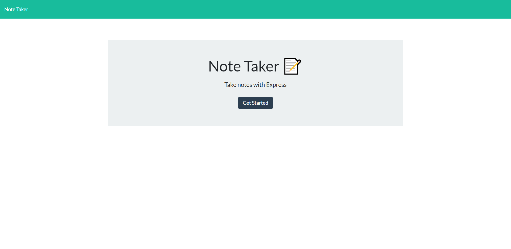
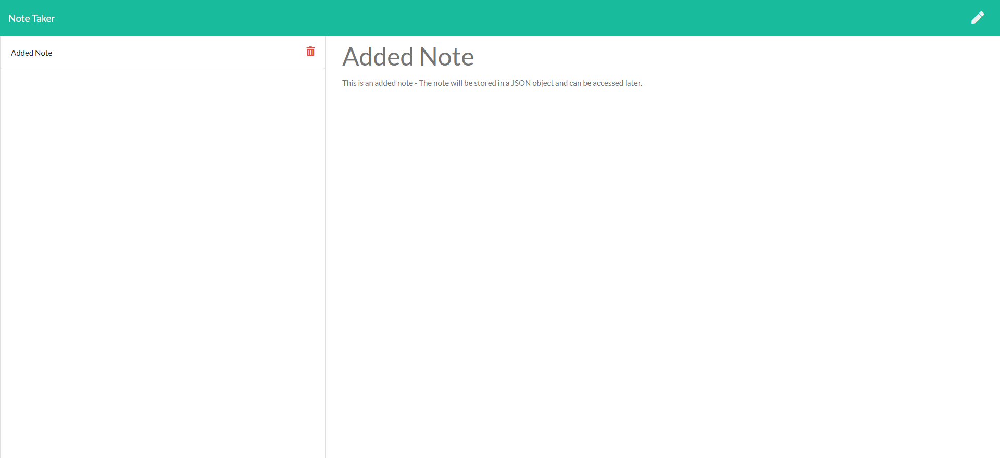

# note-taker

## Description 

The purpose of this application is to create an application that can be used to write, save, and delete notes. This application will use express backend and save and retrieve note data from a JSON file. The front end code for this application was provided and then I created the backend script using express.

The webpage is hosted on [Heroku](https://).

You can find the repo on [GitHub](https://github.com/Rconat/note-taker).

---

## Table of Contents

* [Installation](#Installation)
* [List of Files](#List-of-Files)
* [Express NPM](#Express-NPM)
* [Usage](#usage)
* [Credits](#credits)

---

## Installation

This application requires express and uuid to run. Install all packages using the following code:

    npm install express uuid

or you may use the following code if you already have your package.json file:

    npm install

---

## List of Files

<ul>
    <li>server.js</li>
    <li>package.json</li>
    <li>package-lock.json</li>
    <li>README.md</li>
    <li>.gitignore</li>
    <li>apiRoutes.js</li>
    <li>htmlRoutes.js</li>
    <li>notes.html</li>
    <li>index.html</li>
    <li>index.js</li>
    <li>styles.css</li>
    <li>noteTakerMain.png</li>
    <li>noteTakerAddedNote.png</li>
    <li>db.json</li>
</ul>

---

## Express NPM

Express NPM is a Node.js web application framework. This framework is used to help develop Node based web applications. The Express framework allows us to set up middlewares that will respond to HTTP requests. Express also allows us to define our routing modules in both the api-routes.js file as well as the html-routes.js file and then using those requests we can dynamically render HTML pages client side to be used in the application. Express is mainly implemented in the server.js file however it references all of the route modules. Express is the framework that allows are client side to communicate with the server side database. For more information about express visit the [Express Documentation](https://www.npmjs.com/package/express).

---

## Usage 

The "note-taker" application allows users to input a note and save it. The note can be accessed on the left hand side of the screen and then deleted with the delete button. All notes are stored in the db.json file.

---

## Credits

Working alongside professors and TAs through Trinity and Northwestern Coding Bootcamp to provide the file structure and directories as well as the assignment parameters. For this assignment the front end code was provided.

For more information about the application contact me at ryan.conat@gmail.com

---

